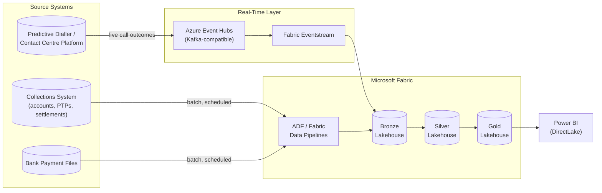

# Debt Collection Lakehouse (Microsoft Fabric Pattern)

A large-scale Bronze → Silver → Gold medallion pipeline for a debt collection operation — modelled on the kind of book a collections / BPO business like Ison Xperiences manages: debtor accounts, promise-to-pay (PTP) agreements, payments, discounted settlements, and collection call activity.

**Scale:** 1.15M+ rows generated and processed end-to-end in under 30 seconds using chunked, memory-flat processing — the discipline required when a Fabric notebook reads billions of rows from OneLake rather than loading everything into memory at once.

## Why this exists

Collections businesses live and die by a handful of numbers: how much of the book is recoverable, which agents and channels actually get people to pay, and whether promises-to-pay convert into real cash. This project builds the data platform that answers those questions at scale, using the same medallion architecture pattern used in production Microsoft Fabric lakehouses.

## Data Model

| Table | Rows | Description |
|---|---|---|
| `debtors` | 60,000 | Demographics: region, age band, employment status |
| `accounts` | 150,000 | Debt accounts: original creditor, balance, debt age bucket, assigned agent |
| `collection_activities` | 600,000 | Every call/SMS/email/WhatsApp attempt and its outcome |
| `ptps` | 120,000 | Promise-to-pay agreements: promised amount, date, kept/broken/pending status |
| `payments` | 200,000 | Actual payments received against accounts |
| `settlements` | 18,000 | Discounted full-and-final settlement agreements |

## Architecture

```
data/raw/  (1.15M rows, CSV)
    │
    ▼
[Bronze]  Chunked ingest, 50K rows/chunk, memory stays flat at any scale
    │     In Fabric: spark.read.csv(path).write.format("delta").save("Tables/bronze_x")
    ▼
[Silver]  Cleansing: drop zero-balance accounts, deduplicate account_ids,
          reject orphan account references, calculate recovery_pct
    │     In Fabric: df.dropDuplicates().write.format("delta").save("Tables/silver_x")
    ▼
[Gold]    Collections KPIs:
          • Recovery performance by debt age bucket
          • PTP kept rate (the #1 collections health metric)
          • Agent performance leaderboard
          • Settlement / discount band analysis
          • Monthly cash collected
          In Fabric: DirectLake dataset → Power BI collections dashboard
```

## Sample Output

```
Bronze: 1,148,000 rows ingested (50K rows/chunk)
Silver: 749 dirty accounts rejected, 4,772 orphan activities rejected,
        575 invalid PTPs rejected, 1,005 invalid payments rejected

RECOVERY PERFORMANCE BY DEBT AGE BUCKET
debt_age_bucket  accounts  avg_recovery_pct
        181-365     32318             27.38
          31-60      5293             26.75
           365+     90848             27.31
          61-90      5202             27.09
         91-180     15590             27.52

Overall PTP kept rate: 42.17%
Total cash collected: R407,022,433.30
```

## Tech stack

Python, pandas (vectorised with numpy for million-row generation), chunked CSV processing (→ PySpark/Delta Lake in production Fabric).

## Running it

```bash
pip install -r requirements.txt
python src/generate_sample_data.py     # ~15s, generates 1.15M rows
python src/medallion_pipeline.py       # ~15s, full Bronze→Silver→Gold run
```

Run the tests (fast — isolated logic tests, not the full 1.1M-row pipeline):

```bash
python -m unittest discover -s tests -v
```

## What I'd add for production

- Swap chunked CSV for Delta Lake tables on OneLake, with `MERGE` for incremental Silver loads
- Partition Bronze/Silver by `activity_date` / `placement_date` for partition pruning at scale
- Build a real-time PTP breach alert using Fabric Real-Time Analytics (Eventstream) so agents get notified the day a promise is missed
- Publish the Gold tables as a DirectLake Power BI dataset for sub-second collections dashboards

## Production Architecture

This repo simulates the medallion pipeline locally with chunked pandas so it runs without a Fabric workspace. In production, this is how it would actually run:



**Why both batch and streaming:** Accounts, PTPs, and settlements update at business pace (hourly/daily batch via ADF or Fabric Data Pipelines is fine). Collection call outcomes from a predictive dialler are different — agents and supervisors need to see a broken PTP or a "refused to pay" outcome within seconds, not after the next batch run. That's where **Azure Event Hubs** (using its native Kafka protocol support — existing dialler Kafka producers can point straight at it) feeding **Fabric Eventstream** comes in, landing events directly into the Bronze Lakehouse in real time. The `collection_activities` chunked-ingest logic in `medallion_pipeline.py` mirrors exactly what that Eventstream-to-Bronze write would do, just replayed from a file instead of a live topic.

If the source collections system is on-premises rather than SaaS, the batch leg (Collections System / Bank Payment Files → ADF) would also require a **Self-hosted Integration Runtime**, the same way the SAP healthcare migration project does.

## License

MIT — all data is synthetic.
